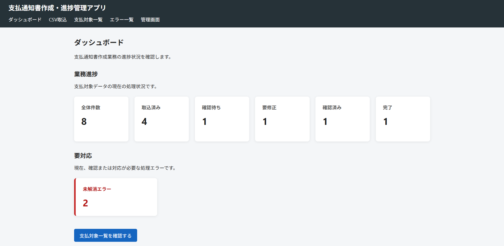
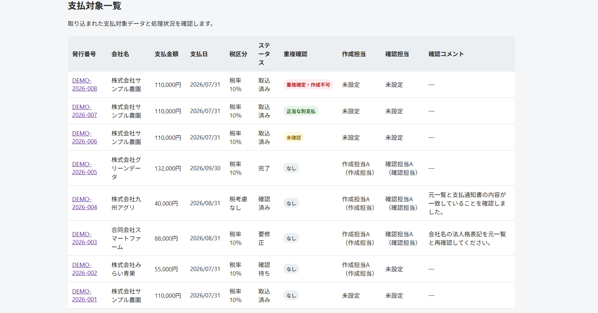
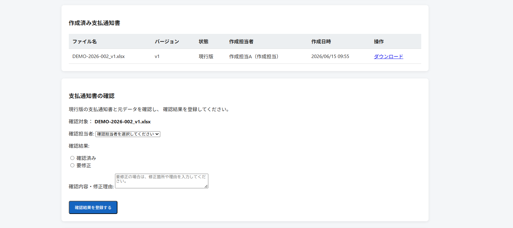
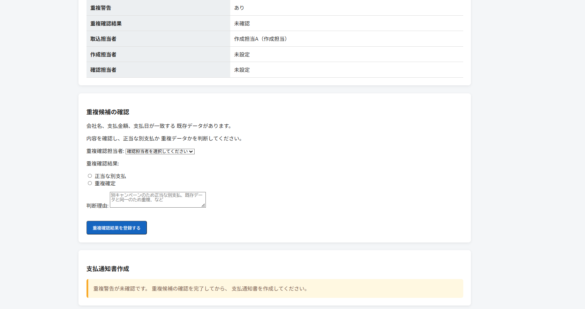
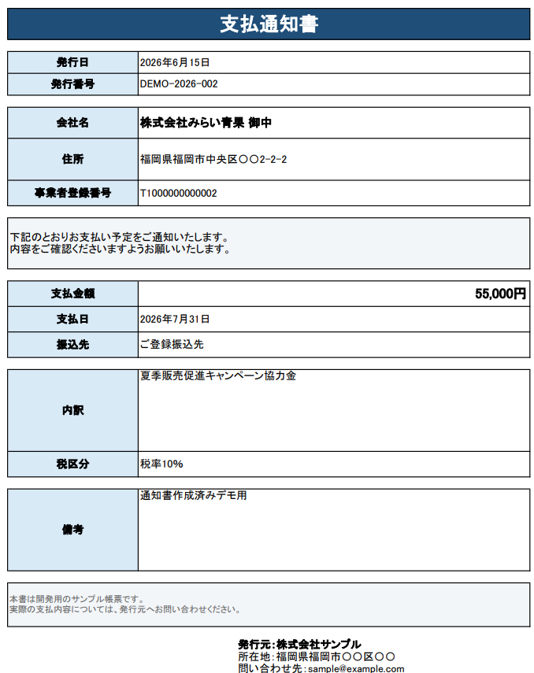
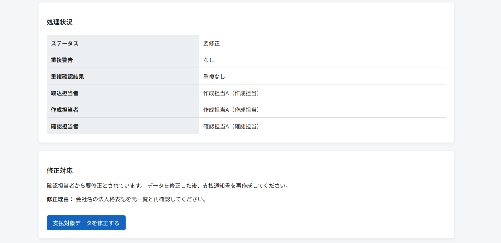
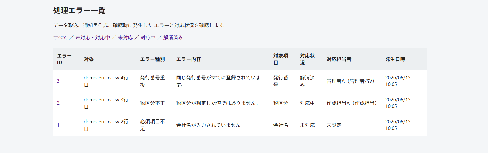

# 支払通知書作成・進捗管理アプリ

CSVで受領した支払対象一覧から、Excel形式の支払通知書を自動作成し、作成・確認・修正・完了までの進捗やエラーを管理するDjango Webアプリです。

前職で経験した支払通知書作成業務を題材に、手動転記による入力ミス、重複作成、進捗共有の属人化といった課題を解決することを目的として開発しました。

---

## 公開デモ

以下のURLから、デプロイしたアプリをご覧いただけます。

[支払通知書作成・進捗管理アプリを開く](https://takuroannoura.pythonanywhere.com/)

> このサイトはポートフォリオ用の閲覧専用デモです。  
> データの登録・変更・削除操作は無効にしています。  
> 作成済みの支払通知書や、各ステータス・作業履歴をご確認いただけます。

---

## 画面イメージ

### ダッシュボード

業務進捗と未解消エラーを分けて表示し、各状態の件数を確認できます。



### 支払対象一覧

支払対象、処理ステータス、担当者、重複確認結果、確認コメントを一覧で管理します。



### 支払通知書の作成・確認

作成済みファイルのバージョン管理と、確認担当者による確認済み・要修正の登録を行います。



### 重複候補の確認

会社名・支払金額・支払日が一致するデータを重複候補として検知します。

担当者が「正当な別支払」または「重複確定」を理由とともに登録するまで、支払通知書の作成を停止します。



### Excel支払通知書

取り込んだ支払対象データを、Excelテンプレートの指定セルへ自動で反映します。



---

## 開発の背景

実務では、営業担当者から受領したキャンペーンのキャッシュバック一覧をもとに、会社名、住所、事業者登録番号、支払金額、支払日、内訳などを支払通知書へ転記していました。

手作業と表計算ファイルを中心とした運用には、次の課題がありました。

* 手動転記による会社名・金額・支払日などの入力ミス
* 同じ支払通知書の重複作成
* Excelや口頭共有による進捗状況の分かりにくさ
* エラー対応や修正履歴の追跡が困難
* 担当者ごとに作業方法が異なる属人化

本アプリでは、一覧データの取込から通知書作成までを自動化し、人は作成結果の確認や例外判断に集中する業務フローを想定しています。

---

## 主な機能

### CSV取込

* 支払対象一覧のCSV取込
* UTF-8および日本語版ExcelのCSV（CP932）に対応
* 必須列・必須項目チェック
* 金額・日付・事業者登録番号の形式チェック
* 税区分の全角・半角表記への対応
* 正常・警告・エラーデータの分類
* 空のCSVテンプレートをダウンロード
* 入力例付きCSVテンプレートをダウンロード

### 重複チェック

* 発行番号が同一の場合は重複エラー
* 会社名・支払金額・支払日が一致する場合は重複候補
* 正当な別支払／重複確定の人による判断
* 未確認または重複確定時の通知書作成停止

### 支払通知書作成

* Excelテンプレートへの自動転記
* 発行日、発行番号、会社名、住所、登録番号の反映
* 支払金額、支払日、内訳、税区分、備考の反映
* 「ご登録振込先」の固定表示
* Excelファイルのダウンロード
* 再作成時のバージョン管理
* 過去バージョンの保持

### 確認・修正

* 作成担当者と確認担当者の分離
* 確認済み／要修正の登録
* 要修正時の理由入力
* 支払対象データの編集
* 修正後の通知書再作成
* 再確認フロー

### 進捗管理

* 取込済み
* 確認待ち
* 要修正
* 確認済み
* 完了

ダッシュボードの各カードから、該当する支払対象一覧へ移動できます。

### エラー管理

* 一般業務画面でのエラー一覧・詳細表示
* 未対応／対応中／解消済みの管理
* 対応担当者と対応内容の記録
* 解消日時の記録
* 解消済みエラーの履歴保持

### 作業ログ

次の操作履歴を記録します。

* CSV取込
* 支払通知書作成・再作成
* 確認結果登録
* データ修正
* 重複確認
* エラー対応
* ステータス変更
* 完了処理

データ修正時は、変更前と変更後の値も確認できます。

---

## 基本業務フロー

```text
営業担当者から支払対象一覧を受領
    ↓
CSVをアプリへ取り込む
    ↓
必須項目・形式・重複を自動チェック
    ↓
正常データから支払通知書を作成
    ↓
確認担当者が元一覧と作成結果を照合
    ↓
確認済み または 要修正
    ↓
要修正の場合はデータ修正・再作成・再確認
    ↓
管理者/SVが完了処理
```

---

## 設計上の工夫

### 現場業務をもとに仕様を整理

実際に経験した支払通知書作成業務をもとに、課題定義、ユーザー像、機能一覧、画面一覧、データ項目、業務フローを先に整理してから実装しました。

単に画面や機能を作るのではなく、「誰が、どのタイミングで、何を確認するのか」を整理したうえで、アプリ上のステータスや操作フローに反映しています。

### 重複を完全自動判定しない設計

会社名、支払金額、支払日が同じでも、別キャンペーンによる正当な支払いの場合があります。

そのため、システムは重複候補を検知して作成を一時停止し、最終判断は業務担当者が理由とともに登録する設計としました。

これにより、誤って正当な支払いを除外することを防ぎつつ、重複作成のリスクも管理できるようにしています。

### エラーと業務進捗を分離

支払対象の業務ステータスと、処理エラーの対応状況を別の軸として管理しています。

```text
業務進捗：
取込済み → 確認待ち → 要修正 → 確認済み → 完了

エラー対応：
未対応 → 対応中 → 解消済み
```

業務上の進捗と、データ不備への対応状況を分けることで、「通知書作成の進行状況」と「エラー対応の状況」をそれぞれ確認できるようにしました。

## 開発・実装で工夫した点

### CSV取込時の文字コード対応

営業担当者がExcelで作成したCSVを取り込む場面を想定し、UTF-8だけでなく、日本語環境で使用されるCP932形式のCSVにも対応しました。

これにより、Excelから保存したCSVでも文字化けや取込失敗が起きにくいようにしています。

### CSVテンプレートダウンロード

取込時の列名ミスや入力形式のばらつきを減らすため、空のCSVテンプレートと入力例付きCSVテンプレートをダウンロードできるようにしました。

エラーを取り込んだ後に検知するだけでなく、営業担当者が入力する段階でミスを減らすことを目的としています。

### Excelテンプレートによる通知書生成

支払通知書はopenpyxlを使用してExcel形式で自動生成しています。

出力レイアウトをテンプレート化することで、通知書の見た目を一定に保ちながら、会社名、住所、支払金額、支払日、内訳などを自動で反映できるようにしました。

### 帳票のバージョン管理

通知書を再作成した場合も既存ファイルを上書きせず、v1、v2のように履歴を残します。

これにより、修正前後の通知書を区別でき、後から作成履歴を確認しやすいようにしています。

### 閲覧専用デモ化

公開デモでは、採用担当者や講師が画面を確認できる一方で、登録・更新・削除などの操作は制限しています。

これにより、デモデータを維持したまま、実際の画面や業務フローを安全に確認できるようにしました。

---

## 使用技術

| 分類      | 技術                            |
| ------- | ----------------------------- |
| バックエンド  | Python、Django                 |
| フロントエンド | HTML、CSS、Django Template      |
| データベース  | SQLite                        |
| Excel処理 | openpyxl                      |
| 開発環境    | Windows 10、Visual Studio Code |
| バージョン管理 | Git、GitHub                    |

---

## データモデル

主に以下のモデルで構成しています。

| モデル               | 役割            |
| ----------------- | ------------- |
| Operator          | 管理者・作成担当・確認担当 |
| ImportBatch       | CSV取込履歴       |
| PaymentRecord     | 支払対象データと進捗    |
| GeneratedDocument | 作成済み通知書とバージョン |
| ProcessingError   | 取込・処理エラー      |
| WorkLog           | 操作履歴          |

---

## 補足画面

### 要修正データ

確認担当者の修正理由を作成担当者へ引き継ぎ、データ修正と再作成へ進めます。



### エラー一覧

未対応・対応中・解消済みのエラーを、削除せず履歴として管理します。



---

## セットアップ

### 1. リポジトリを取得

```bash
git clone https://github.com/TakuroAnnoura/payment-notice-management-app.git
cd payment-notice-management-app
```

### 2. 仮想環境を作成・有効化

Windows：

```cmd
python -m venv .venv
.venv\Scripts\activate
```

### 3. 必要なパッケージをインストール

```cmd
pip install -r requirements.txt
```

### 4. データベースを作成

```cmd
python manage.py migrate
```

### 5. 管理ユーザーを作成

```cmd
python manage.py createsuperuser
```
管理画面から、必要に応じて以下の担当者を登録します。
| 担当者   | 役割     |
| ----- | ------ |
| 管理者A  | 管理者/SV |
| 作成担当A | 作成担当   |
| 確認担当A | 確認担当   |


### 6. 開発サーバーを起動

```cmd
python manage.py runserver
```

ブラウザで以下を開きます。

```text
http://127.0.0.1:8000/
```

---

## デモデータ

データベースファイルはリポジトリに含めていないため、初回セットアップ時のデータは空の状態です。

動作確認用のCSVファイルを `test_data` フォルダに保存しています。

* `demo_payments.csv`：通常データおよび重複候補を含む支払対象データ
* `demo_errors.csv`：必須項目不足、税区分不正、発行番号重複の確認用データ

管理画面から担当者を登録した後、CSV取込画面から上記ファイルを取り込むことで、主要機能を確認できます。

発表用に作成した各ステータスや操作結果は、README内の画面イメージに掲載しています。

---

## MVPでの制約

* ログインユーザーと担当者情報は連携していません
* 操作時に担当者を手動で選択します
* 1人につき1種類の役割を設定しています
* 支払通知書のメール送信機能はありません
* PDFの自動生成は行わず、Excel形式で出力します
* 事業者登録番号は形式のみを確認し、外部マスタとの照合は行いません

---

## 今後の課題

* ログインと詳細な権限制御
* 1人が複数権限を持つ仕組み
* 帳票用備考と社内メモの分離
* 重複確定・対象外ステータスの追加
* エラー解消後の対応結果分類
* 一般ユーザー向け取込履歴画面
* 税抜金額・消費税額・支払合計額の分離
* 事業者登録番号の外部データ照合
* 約1000件規模の一括作成
* ZIP形式での一括ダウンロード
* Excelと元一覧の自動整合性チェック
* PDF形式での出力

---

## 開発ドキュメント

`docs`フォルダには、次の資料を保存しています。

* 課題定義
* ユーザー像
* 機能一覧
* 画面一覧
* データ項目
* 業務フロー
* 支払通知書テンプレート仕様
* MVP総合テスト計画
* 改善バックログ
* 発表用サンプルデータ計画
* 画面キャプチャ計画

---

## 開発方針

本制作では、AI仕様駆動開発を意識し、次の順番で開発を進めました。

```text
現場課題の整理
    ↓
ユーザーと業務フローの定義
    ↓
機能・画面・データ項目の仕様化
    ↓
Djangoによる実装
    ↓
MVP総合テスト
    ↓
改善バックログの整理
    ↓
発表用データ・READMEの整備
```

AIが生成したコードをそのまま使用するのではなく、実際の業務経験をもとに仕様や例外ケースを補正し、動作確認と改善を繰り返しました。
